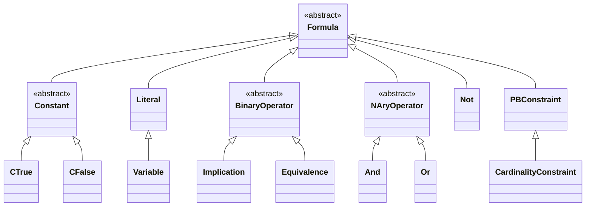
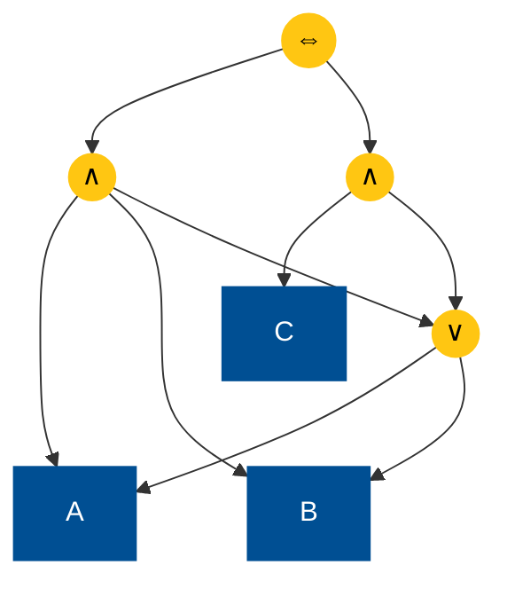
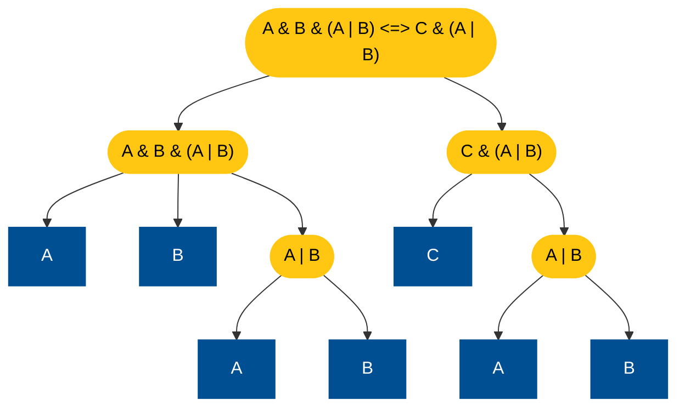

As described in the previous chapter, there are different ways to create formulas, which all involve a [formula factory](../formula-factory).

Here is an overview of the formula hierarchy in LogicNG:



In this chapter we discuss the properties of formulas.  There are dedicated chapters on predicates, functions, and transformations on formulas.


## Properties of Formulas

The most used properties of a formula are:

- The **type** of a formula indicates whether the formula is an implication, a conjunction, etc. The type can be retrieved by `#!java formula.type()` (see [`FType`](https://github.com/logic-ng/LogicNG/blob/master/src/main/java/org/logicng/formulas/FType.java))
- The set of **variables** contains all variables occurring (positively and/or negatively) in the formula, can be retrieved by `#!java formula.variables()`
- Similarly, `#!java formula.literals()` returns the set of all **literals** occurring in the formula

Further, one can check for every formula the following numbers:


### The Number of Atoms

The atoms of a formula are variables or constants, counting multiple occurrences. For example, formula `A & B | A & C` has 3 variables, but 4 atoms. You can check the number of atoms with `#!java f1.numberOfAtoms()`.


### The Number of Nodes and Internal Nodes

Any formula can be visualised (and thought of) as a directed acyclic graph (DAG). We consider the following example formula

``` java
Formula f1 = f.parse("A & B & (A | B) <=> C & (A | B)");
```



The graph is also the internal representation of the formula. If you are interested in the size of the formula in memory, use `#!java f1.numberOfInternalNodes()`. In this example this is 7, as the internal nodes are:

- `A & B & (A | B) <=> C & (A | B)`
- `A & B & (A | B)`
- `C & (A | B)`
- `A | B`
- `A`
- `B`
- `C`

On the other hand, one can also think of a formula as a tree like in the abstract syntax tree (AST) of the parsed formula. For `f1` the corresponding AST is:



`#!java f1.numberOfNodes()` returns the number of nodes of a formula tree. For `f1` the result is 12, consisting of the following nodes:

- `A & B & (A | B) <=> C & (A | B)`
- `A & B & (A | B)`
- `C & (A | B)`
- `(A | B)` (2x)
- `A` (3x)
- `B` (3x)
- `C`

It is important to note however, that LogicNG always only stores the DAG in memory, therefore reducing heap size.


### The Number of Operands

This number is 0 for constants and variables, 1 for a negation, 2 for binary operators, and ≥ 2 for n-ary operators. For formula `A & B | C` the operands of the top-level disjunction are `A & B` and `C`, thus the number of operands is two.


### Normal Form Predicates

[:octicons-tag-24: 2.3.0](https://github.com/logic-ng/LogicNG/releases/tag/v2.3.0)

The following three predicates determine if a formula is in a given [normal form](operations/transformations/normal-form-transformations):

- `isNnf()`: whether the formula is in negation normal form (NNF)
- `isCnf()`: whether the formula is in conjunctive normal form (CNF)
- `isDnf()`: whether the formula is in disjunctive normal form (DNF)


## Useful Methods for Formulas

There are a couple of useful methods for working with formulas.


### Evaluating Formulas

A formula can be evaluated with an assignment.  That is all variables in the formula will be set to the truth value given in the assignment.  If a variable is not contained in the assignment, it is set to false.  Consider the assignment `{~A, C}` for the formula `A & B | C`.  We want to check whether the formula is satisfiable under this assignment. This can be done in the following way:

```java
Assignment assignment = new Assignment();
assignment.addLiteral(f.literal("A", false));
assignment.addLiteral(f.literal("C", true));
boolean result = formula.evaluate(assignment);
```

The result is `true`, since the right-hand side of the disjunction evaluates to true and therefore the whole disjunctions evaluates to true.

!!! info "Fast Evaluable Assignments"

    An `Assignment` can be created with an optional boolean parameter `fastEvaluable` which is by default false.  This parameter decides how the assignment internally stores its literals.

    If set to `false`, the literals are stored in a list.  This allows for a faster generation of the assignment and slightly smaller memory footprint, but evaluation is slow since finding a literal in the internal data structure takes linear time.
    If set to `true`, the literals are storen in a set.  Thus the generation of the assignment takes a little bit longer and the footprint is slighlty larger but searching a literal in the map takes constant time.

    Often (e.g. in [model enumeration](../model-counting-enumeration)) you don't use the generated assignment to evaluate or restrict formulas, so you don't neet fast evaluable assignments and can therefore save some time and memory creating them.  However, if you plan to use the assignments to evaluate or restrict formulas, *always* set the `fastEvaluable` flag to `true`.


### Restricting Formulas

A formula can be restricted with an assignment.  In contrast to an evaluation, variables not contained in the assignment are not set to false, but left untouched.  Therefore, the result of a restriction is usually not a simple truth value, but another formula.  Consider the assignment `{~A}` for the formula `A & B | C`.  We want to restrict the formula with this assignment.  This can be done in the following way:

```java
Assignment assignment = new Assignment();
assignment.addLiteral(f.literal("A", false));
Formula result = formula.restrict(assignment);
```

The result is `C`, since the left-hand side of the disjunction restricts to false and therefore the right-hand side must be true.  Note that since the formula factory automatically removes constants from formulas, also restricted formulas never contain constants.


### Substituting Variables

Variables in a formula can be substituted with other formulas. For example, within the formula `A & B | C`, we want to substitute `A` by `D & E` and `C` by `F`:

```java
Substitution substitution = new Substitution();
substitution.addMapping(f.variable("A"), f.parse("D & E"));
substitution.addMapping(f.variable("C"), f.parse("F"));
Formula result = formula.substitute(substitution);
```

The result is `D & E & B | F`.


### Negation Normal Form

A formula is in negation normal form (NNF) if it consists only of literals and the operands `&` and `|`. For example, the formula `A | ~(B | C)` is *not* in NNF but formula `A | (~B & ~C)` is in NNF. The formulas `A & B | C` and `A & B | A & C` are in NNF. A NNF of a formula can be computed with `#!java formula.nnf()`.

## Executing Operations on Formulas and Implementing Own Operations

There are three generalized types of operations which can be executed on formulas:

1. *Functions*:  A function takes a formula as input and computes some value on that formula.  This value can be a simple integer e.g. the depth of a formula, or a more complex result type, like the list of sub-formulas.  Functions are applied on a formula with the `.apply()` method.  Functions will be discussed in detail in the chapter [Formula Functions](operations/formula-functions).
2. *Predicates*: A predicate takes a formula as input and computes a truth value on that formula, e.g. whether a formula is in a certain normal form like NNF, CNF, or DNF, or if it is satisfiable?  Predicates are evaluated on a formula with the `.holds()` method.  Predicates will be discussed in detail in the chapter [Formula Predicates](operations/formula-predicates).
3. *Transformations*: A transformation takes a formula as input and returns another formula, thus transforming the input formula.  Examples for transformations are normal form conversions like NNF, CNF, DNF, or formula simplification.  Transformations are executed on a formula with the `.transform()` method.  Transformations will be discussed in detail in chapter [Formula Transformations](operations/transformations/).

The result of those operations can be stored in the *cache* of a formula. If the result of an operation is cached, then, whenever the same operation is called again on this formula, the operation is not re-computed, but rather the preceding result is reused.  This of course only is possible because formulas are immutable.

There are many functions, predicates, and transformation already implemented in LogicNG, but the user can also implement her own by implementing the respective interfaces.  The user can also define her own cache types and therefore decide if the results of her own operation should be cached or not.

Here is an example of a custom formula function which computes how often variable "a" occurs in a formula which result is cached.  First we have to introduce a new cache object for our function:

``` java
class MyImportantFunctionCacheEntry implements CacheEntry {

    @Override
    public String description() {
        return "My very important function computing the number of a's";
    }
}
```

Next we implement our function:

``` java
class MyImportantFunction implements FormulaFunction<Integer> {

    private static final CacheEntry CACHE_ENTRY = new
            MyImportantFunctionCacheEntry();

    @Override
    public Integer apply(Formula formula, boolean cache) {
        Object cached = formula.functionCacheEntry(CACHE_ENTRY);
        if (cached != null) {
            return (Integer) cached;
        }
        Integer countA = formula
                .apply(new VariableProfileFunction())
                .getOrDefault(formula.factory().variable("a"), 0);
        if (cache) {
            formula.setFunctionCacheEntry(CACHE_ENTRY, countA);
        }
        return countA;
    }
}
```

So first, we construct a new singleton for the cache entry for our new formula function.  In the `apply` method, we first check, if we already have a cached entry for our function - if so, we return otherwise, we compute the number of occurrences of the variable "a" in the formula (by means of the variable profile function, which will be discussed later) and cache the result, if the user wants to cache.  Then the result is returned.

The function can then be used with or without caching:

```java
Formula formula = f.parse("a & (b | c) => ~a & d | a <=> f");
Integer applyWithCache = formula.apply(new MyImportantFunction());
Integer applyWithoutCache = formula.apply(new MyImportantFunction(), false);
```

By default, the `apply` function sets the `cache` parameter to `true`, so if you do not want to cache the result, you have to manually set the parameter to `false`.  In both cases, the result will be 3.


## Some Remarks on Caching

Whether the result of an operation should be cached or not is always a trade-off between computation time and heap space.  Usually, it is beneficial to cache results, if their computation time is significant and there is a large likelihood that they are computed more than once during a use case.  This can also be the case, when a single computation on a large formula would benefit from cached results on sub-formulas of this large formula.

While many LogicNG functions/predicates/transformations will by their nature cache the results not only for the computed formula, but also for all sub-formulas, this is not an absolute requirement and must not hold for all operations.  It is possible, that an operation caches the result only for the formula it was computed on, but not for sub-formulas of this formula.

!!! warning "Cached Operations Should be Stateless and Path-Independent"
    Note that functions, predicates, and transformations should be stateless, especially if you want to cache the result. For example, if you would add a field `String variableName` to `MyImportantFunction` which is initialized by a constructor parameter and which defines the variable name to be counted, caching would lead to incorrect results if you use different instances of `MyImportantFunction` with different variable names.  Also if an operation is path-dependent, meaning the result of operations depends on the path the operations take through the formula, the results must not be cached for sub formulas.


