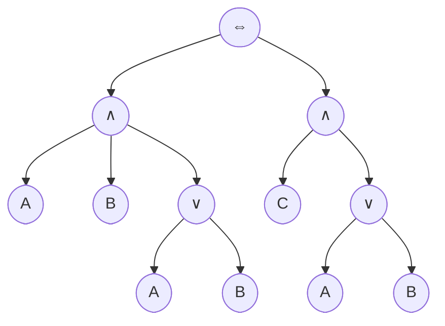
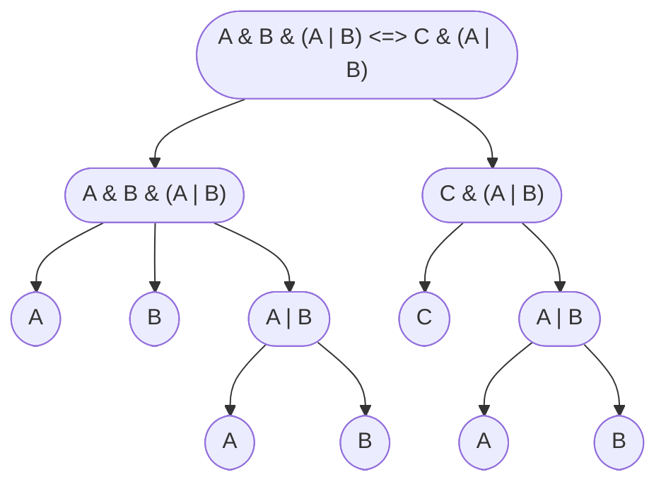
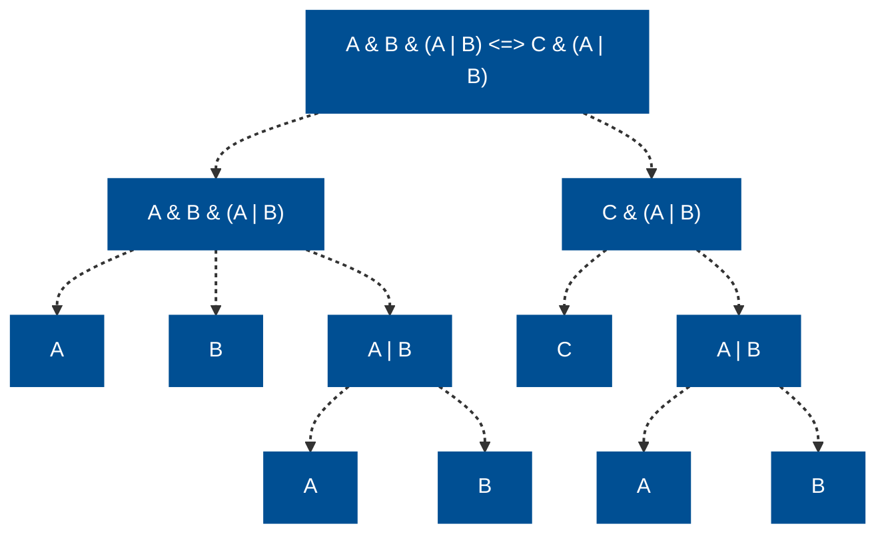
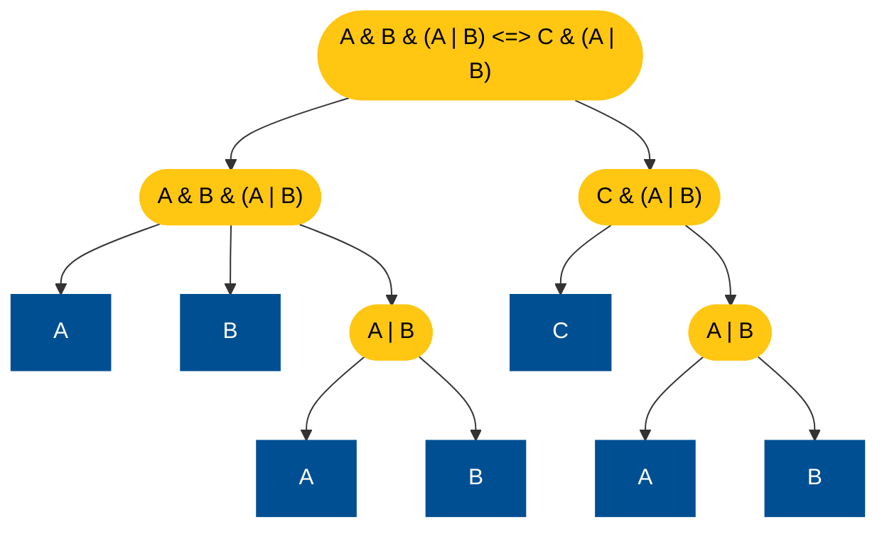

There are some useful I/O classes for parsing/reading/writing formulas and other data structures.

## Parsers

Parsers are used to parse formula strings into LogicNG [formulas](../formulas).  Throughout the documentation, we used the default parser on formula factories by calling `#!java f.parse(...)`, but we can also generate parsers by hand or - most important - implement own parsers for our applications.

Parsers in LogicNG are generated by the parser framework [ANTRL](https://www.antlr.org/) (LogicNG's only external dependency).  You only define a grammar file and ANTLR generates the Java classes for the parser at compile time.  LogicNG's parser grammars lie [here](https://github.com/logic-ng/LogicNG/tree/master/src/main/antlr).  There are two parsers:

1. [PropositionalParser](https://github.com/logic-ng/LogicNG/blob/master/src/main/java/org/logicng/io/parsers/PropositionalParser.java) for parsing propositional formulas without cardinality or pseudo-Boolean constraints.  Its grammar can be found [here](https://github.com/logic-ng/LogicNG/blob/master/src/main/antlr/LogicNGPropositional.g4)
2. [PseudoBooleanParser](https://github.com/logic-ng/LogicNG/blob/master/src/main/java/org/logicng/io/parsers/PseudoBooleanParser.java) for parsing formulas with cardinality or pseudo-Boolean constraints.

!!! tip "Application Insight"

    You can easily implement you own parsers for you propositional language by looking at these grammar files and implementing your own parser inheriting from [FormulaParser](https://github.com/logic-ng/LogicNG/blob/master/src/main/java/org/logicng/io/parsers/FormulaParser.java).  Then you only need to write minimal code.


## Readers

There are two formula readers implemented in LogicNG:

- [DIMACS reader](https://github.com/logic-ng/LogicNG/blob/master/src/main/java/org/logicng/io/readers/DimacsReader.java) for reading CNF files as used in the SAT competition in the [DIMACS CNF format](http://beyondnp.org/static/media/uploads/docs/satformat.pdf).
- [Formula reader](https://github.com/logic-ng/LogicNG/blob/master/src/main/java/org/logicng/io/readers/FormulaReader.java) for reading files in LogicNG syntax from a file.

The formula reader can read propositional formulas with or without pseudo-Boolean constraints.  Multiple lines in a file are interpreted as a conjunction of the formulas in each line.


## Writers

There are three writers for formulas in the `org.logicng.io` package:

- [DIMACS writer](https://github.com/logic-ng/LogicNG/blob/master/src/main/java/org/logicng/io/writers/FormulaDimacsFileWriter.java) for writing CNFs as DIMACS CNF files like described above.
- [Formula writer](https://github.com/logic-ng/LogicNG/blob/master/src/main/java/org/logicng/io/writers/FormulaWriter.java) for writing formulas in LogicNG syntax.  The formula writer has the option `splitAndMultiline` which, if set to `true`, writes the different operands of a top-level conjunction in single lines.  This can often improve readability, and the corresponding `FormulaReader` can read this format.

For [graphs](../graphs), there are two writers:

- [DIMACS writer](https://github.com/logic-ng/LogicNG/blob/master/src/main/java/org/logicng/graphs/io/GraphDimacsFileWriter.java) for writing a [DIMACS graph file](https://github.com/akinanop/mvl-solver/wiki/DIMACS-Graph-Format) of the graph.


## Graphical Writers

[:octicons-tag-24: 2.4.0](https://github.com/logic-ng/LogicNG/releases/tag/v2.4.0)

Instead of writing plain text files of formulas, BDDs, or graphs, it is often desireable to generate graphical representations of these data structures.  LogicNG has a generic framework for generating such graphical output in the package `org.logicng.io.graphical`.  The framework has the following features:

1. It can produce output in two different formats:
    - [DOT language](https://graphviz.org/doc/info/lang.html): for generating files which can be turned into graphical representations by e.g. GraphViz
    - [Mermaid.js](https://mermaid-js.github.io/mermaid/#/): With Mermaid.js you can easily integrate the generated graphs in a web page or application and can play around with it in the [interactive live editor](https://mermaid.live/).
2. Individual node labels: the node label can be dynamically generated depending on the node's content.
3. Individual styling of nodes: The shape, stroke color, text color, and background color of nodes for the graph can be styled either by a fixed style or with a dynamically depending on their content.
4. Individual styling of edges: The type and color of edges for the graph can be styled either by a fixed style or with a dynamically depending on the nodes they connect.

### Basics

There are some basic classes which are used in all graphical representations:

- `GraphicalColor` for the representation of colors either in hex or in RGB whith some nice-looking predefined colors.
- `GraphicalNode` for a node in the graphical representation.
- `GraphicalEdge` for an edge in the graphical representation.
- `GraphicalNodeStyle` for the style of a node.
- `GraphicalEdgeStyle` for the style of an edge.

From these basic building blocks, a `GraphicalRepresentation` is built.  This is always the first step and is usually done by using one of the implemented graphical generators (see next section).  Once you have generated this representation, you can decide in which format and how it is written - either as string or directly to a file.


### Graphical Generators

There are four different generators for graphs:

1. `BddGraphicalGenerator` for generating graphical output of BDDs
2. `FormulaAstGraphicalGenerator` for generating graphical outputs of formula ASTs
3. `FormulaDagGraphicalGenerator` for generating graphical outputs of formula DAGs
4. `GraphGraphicalGenerator` for generating graphical outputs of graphs


### Using the Default Styling

If you do not use any further styling, a sensible default look will be applied to the graph.  As an example consider the AST (abstract syntax tree, c.f. [here](/../../../../documentation/formulas/#the-number-of-nodes-and-internal-nodes)) of a formula.  We consider the Formula `A & B & (A | B) <=> C & (A | B)` and create its default representation.

``` java
FormulaFactory f = new FormulaFactory();
Formula formula = f.parse("A & B & (A | B) <=> C & (A | B)");
FormulaAstGraphicalGenerator generator =
        FormulaAstGraphicalGenerator.builder().build();
GraphicalRepresentation representation = generator.translate(formula);
```

Since the `generator` was constructed with no individual styling in the builder, the default style is applied.

For DOT we write the output in a file, for Mermaid.js we just get the `String` of the representation.

=== "Mermaid.js"

    ``` java
    String mermaidString = representation.writeString(GraphicalMermaidWriter.get());
    ```

=== "DOT"

    ``` java
    representation.write("dot-file.dot", GraphicalDotWriter.get());
    ```

This representation with Mermaid.js looks like this:




### Customizing the Node Label

The generators can have their own mapping functions for the node label.  Therefore the user has to implement the `LabelMapper` interface which only has one method which decides which label to use for each node.  Alternatively you can just pass a lambda function as label mapper.

Consider an example where you want to write the whole sub-formula as the node label, then you could just use the `toString()` method as label mapper:

``` java
FormulaAstGraphicalGenerator generator = FormulaAstGraphicalGenerator.builder()
        .labelMapper(Formula::toString)
        .build();
```

Now the representation looks like this:




### Styling Nodes and Edges with a Fixed Style

You can configure the generator with a default style for nodes in edges.  If no dynamic style mapper is given, this style will be applied to all nodes and edges.  The default style can be configured with the `defaultEdgeStyle` and `defaultNodeStyle` methods of the builder.

```java
FormulaAstGraphicalGenerator generator = FormulaAstGraphicalGenerator.builder()
        .labelMapper(Formula::toString)
        .defaultEdgeStyle(GraphicalEdgeStyle.dotted(null)) // (1)!
        .defaultNodeStyle(GraphicalNodeStyle.rectangle(
            GraphicalColor.BLUE, GraphicalColor.WHITE, GraphicalColor.BLUE)) // (2)!
        .build();
```

1. If you pass `null` as the color, the default value of the framework will be taken.  In this case, Mermaid.js decides depending on light/dark mode how to color the edge.  Try it: if you switch to dark mode, the edges are white, in light mode, they are black.
2. You can use some predefined color in the class `GraphicalColor` or define your own in RGB or HEX.

This leads to the following graphics:



### Styling Nodes and Edges Dynamically

You can also style nodes and edges dynamically by passing node style or edge style mappers to the builder.  In the following example we want to distinguish between nodes with literals (terminals) and nodes with sub-formulas (inner nodes).  This can be done by configuring the generator with its own `NodeStyleMapper`.  As above: you can either implement a sub-class or just pass a lambda function.

```java
GraphicalNodeStyle terminalNodeStyle =
        GraphicalNodeStyle.rectangle(BLUE, WHITE, BLUE);
GraphicalNodeStyle innerNodeStyle =
        GraphicalNodeStyle.ellipse(YELLOW, BLACK, YELLOW);

FormulaAstGraphicalGenerator generator = FormulaAstGraphicalGenerator.builder()
        .labelMapper(Formula::toString)
        .nodeStyleMapper((phi) ->
            phi.type() == FType.LITERAL ? terminalNodeStyle : innerNodeStyle)
        .build();
```

This leades exactly to the representation of our documentation:



And here the corresponding dot file output:

{ width=450 }

