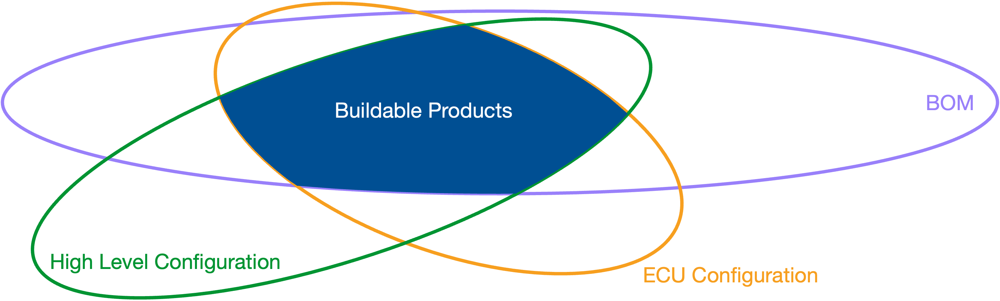

Typically, complex products do not have a single set of rules to describe all aspects of the product, but instead there are many different rule sets describing dependencies between features in different domains.  A few of these rule sets with examples from the automotive industry are presented in the following table.

| Domain                                          | Example                                                                                                                                                               |
| :-----                                          | :------                                                                                                                                                               |
| **High Level Configuration**                    |                                                                                                                                                                       |
| Technical Rules                                 | the feature for the park computer depends on the feature for park sensors                                                                                             |
| Legal Rules                                     | in Germany, each vehicle must have a breakdown triangle                                                                                                               |
| Homologation Requirements                       | in the EU, exhaust emission standard EU6 is mandatory                                                                                                                 |
| Marketing Rules                                 | the US market forces air condition in every vehicle                                                                                                                   |
| **Bill of Materials (BOM)**                     | which steering wheel is built in a vehicle is dependent on features like the wheel itself, interior color, multimedia system, ...                                     |
| **Electronig Control Unit (ECU) Configuration** | the parameter for the vehicle length of the park assistant's ECU is dependent on the exterior package and the existence of a trailer hitch                            |
| **Software Configuration**                      | different versions of a parking assistant's software require different sensors built in the vehicle and are dependent on the software versions of the camera firmware |

As depicted in the next figure, these rule sets have intersections, but single rule sets can also describe more variants than other rule sets allow.  This is due to the fact that each domain describes only the variance which is relevant to it: a bill of material (BOM), e.g., can describe hardware variants which are currently not sold in any market, but might be in the future.

{ width=700 }

Each rule set can be verified individually for certain validation criteria, e.g. that there is no contradiction in the set of rules. Further, verifications across different rule sets are common. Usually, the high level configuration (HLC) is used as base rule set, since it describes all buildable products on a certain level (technical, for a certain legislator, in a certain marketing region, ...). Other rule sets are then verified against this HLC to prove certain properties. The next table presents some tasks commonly performed and properties commonly validated on the example of a vehicle.

| Domain                                           | Example Tasks and Verifications                                                                                                                                                                                                                                                          |
| :-----                                           | :------------------------------                                                                                                                                                                                                                                                          |
| **General**                                      | <ul><li>simplification of rules with and without consideration of the HLC</li><li>visualization of rules, transformation of rules into certain formats</li><li>evaluation of rules for single configurations</li></ul>                                                                   |
| ** High Level Configuration **                   | <ul><li>validation of the consistency of the rule set</li><li>computation of non-buildable and enforced features</li><li>projection of the rule set to certain scopes</li><li>computation of impacts of changes in the rule set</li></ul>                                                |
| ** Bill of Materials (BOM)**                     | <ul><li>verification that positions (e.g. side mirror) are unique, meaning exactly one variant is taken for each buildable vehicle</li><li>computation of non-buildable parts in the BOM</li></ul>                                                                                       |
| ** Electronic Control Unit (ECU) Configuration** | <ul><li>verification that parameter values are uniquely defined for each parameter</li><li>validation of the consistency between ECUs in the BOM and the ECU configuration</li><li>simplification of ECU parameter conditions to speed up flashing on the moving assembly line</li></ul> |
| ** Software Configuration**                      | <ul><li>solving software update problems</li><li>computation and optimization of software update paths</li><li>validation of software releases in combination with hardware releases</li></ul>                                                                                           |
